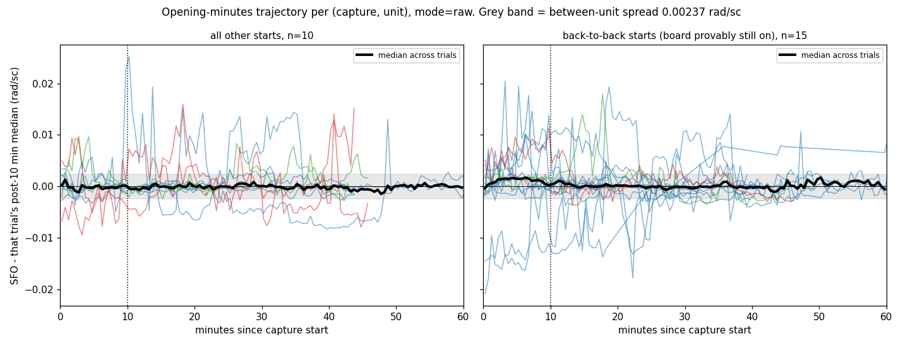
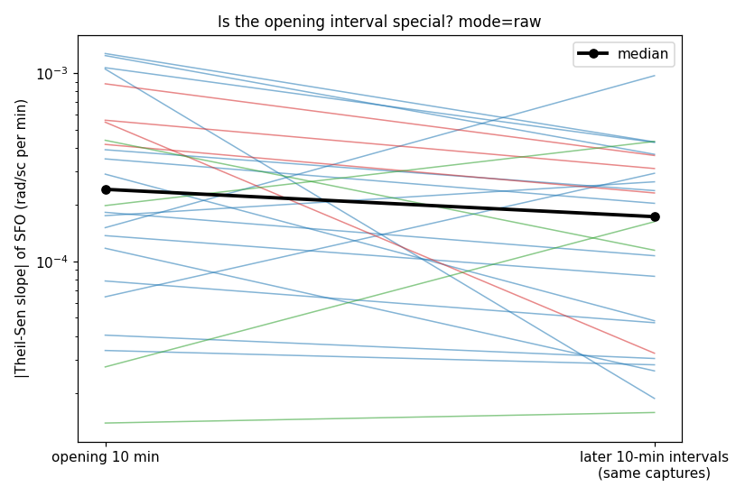
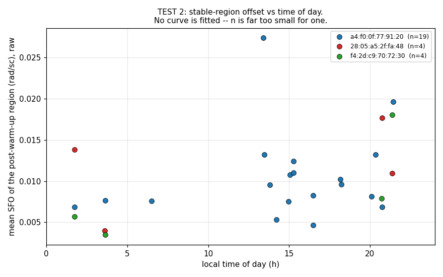

# Is there a thermal signature in the existing captures?

**Date:** 2026-08-15 · **Scope:** read-only re-analysis of `data/raw/`
· **Tool:** `pc/exp_thermal_evidence.py` (new), driving `pc/twin_probe.py`
→ `pc/rff_offline.py` → `pc/rff/`. No DSP was reimplemented, no hardware
was touched, and no existing file was modified.

> **No temperature was ever recorded anywhere in this project, and none is
> recorded here.** Nothing below measures temperature. Every statement in
> this document is about the *shape of the offset over time*, which is a
> proxy a thermal explanation would have to fit — not about heat. A
> previous task was caught asserting thermal causation without evidence;
> this file is the attempt to test that assertion, not to restate it.

---

## Verdict

**No power-on warm-up transient is detectable, and the prediction that
made thermal drift testable on existing data fails on the control rather
than on the noise: captures that begin seconds after the previous one
ended — where the transmitter was provably still on and still warm — show
opening-minutes excursions of the same order as captures that follow
hours of silence, and larger in three of the four (interval, feature
space) cells measured. The fourth cell goes the other way and is recorded
in §3.1 rather than buried.**

Discarding the warm-up region does not buy back stability. Every
head-trim tried makes the session-to-session wander figure slightly
**worse** — **+1% to +20%** across two spaces, two corpora and three trim
lengths — and every head-trim's bootstrap CI includes the untrimmed
baseline. There is no free improvement here.

Three findings, in decreasing order of confidence:

1. **No shared opening transient is detectable (§3).** Across 25 trials from
   17 captures and 3 units, the drift over the first 10 minutes relative
   to the rest of the same capture has a median magnitude of **0.00061
   rad/sc — 0.26× the between-unit spread and 0.11× the
   session-to-session wander** — and no consistent direction (15/25
   positive, exact two-sided binomial **p = 0.42**). A warm-up transient
   with no shared direction is not a warm-up transient; a crystal warming
   from room temperature moves one way. This holds at every opening
   length tried, 5 through 30 minutes (§3.4).

2. **Discarding warm-up does not reduce the wander (§4).** Head-trimming
   5, 10 or 15 minutes moves the wander figure by **+1% to +20%** — the
   wrong way — with the bootstrap CI always straddling the baseline.
   Against a matched tail-drop control on the same sessions, head-trims
   are the worse end in raw; in ref the ordering reverses and tail-trims
   are worse (§4 gives both, and records the one variant in this document
   whose CI excludes its baseline — a tail-drop control, not a
   treatment). Whatever produces the
   0.00570 rad/sc figure is spread through the session, not concentrated
   at its start.

3. **A large part of the raw movement is not on the transmitter's side at
   all (§6).** For the eight session-pairs recorded concurrently by two
   collectors, the two receivers' trajectories for the *same beacon in
   the same minutes* are essentially uncorrelated (median Pearson
   **r = −0.14**), and across the seven where both sides clear the window
   gate their post-warm-up means differ by a median
   **0.00363 rad/sc — 1.53× the entire between-unit spread.** A
   transmitter crystal warming up would move both traces together. This
   does not refute a thermal mechanism; it relocates the candidate away
   from the beacon, which is where every proposed fix has been aimed.

**What this does not settle.** It does not show that temperature is
irrelevant. It shows that the *one* thermal signature this dataset could
resolve — a power-on transient — is not detectable in it, and that the
remaining instability does not have the shape a transmitter-side thermal
explanation predicts. That is a failed prediction, not a measured
absence: §9 records that the central null is unpowered. Room-temperature
drift over hours, and thermal sensitivity of the *receiver*, remain
untested and remain plausible. Settling any of it needs the capture in
§8, not more analysis of these files.

**Braeden's framing was right about which test was strongest.** The
power-on transient is the cleanest thing this data can answer, because
every capture is a trial with a known start — though not, as §3.1 shows,
an independent one with a *cold* start. It
answers it in the negative — and the reason it can answer at all is a
detail of the corpus that had not been used before: **many captures are
back-to-back, so "capture start" and "power-on" come apart, and the
difference between them is measurable (§3.1).**

---

## 1. What a thermal explanation had to predict

`docs/LOT_HYPOTHESIS.md` §5 established the problem: each unit's
session-to-session SFO wander (mean across-unit sd **0.00570 rad/sc**) is
**2.4×** the spread between the three units' grand means (**0.00237**),
and inside the 42-minute prefix of `rx_20260714_031131` the three pairs'
separations range from 0.05σ to 9.08σ across six consecutive chunks —
those two extremes belong to *different* pairs, which
`docs/LOT_HYPOTHESIS.md` §5's own tables show and its summary line
conflates. `docs/HANDOFF.md` open thread #1 proposes embedding TX die
temperature (that list carries no date; only the hardware-inventory
heading in that file is dated 2026-07-15). Thermal drift is the leading
candidate for the instability and has never been tested.

A crystal oscillator on a board switched on from room temperature warms
for roughly ten to thirty minutes before plateauing. Written as something
this data can refuse:

| form | prediction |
|---|---|
| **STRONG** | every capture drifts systematically in its opening minutes, then flattens; the drift shares a direction across captures and units; its magnitude is comparable to 0.00237 or 0.00570 |
| **WEAK** | the opening minutes drift measurably more than later minutes of the same capture, in a shared direction, even if small |
| **REFUTED** | the opening interval is unremarkable against later intervals of the same capture, or has no shared direction, or is no larger after long gaps than after back-to-back starts |

The shared direction is the load-bearing part. A signature that wanders
already drifts in every interval; "the opening minutes drift" is true of
a random walk. Only *direction* and *excess over later intervals*
distinguish a physical ramp from ordinary wander.

## 2. Method

### 2.1 The chain to the production estimator

`pc/twin_probe.py` is reused unchanged for collection, so every number
below comes out of the same path the project's own science run uses:

```
rff.dsp.FrameEstimator / WindowAggregator
  -> rff.reference.ReferenceNormalizer
    -> rff_offline.collect_observations
      -> twin_probe collect  (cache shard)
        -> twin_probe.load
          -> exp_thermal_evidence.py   (binning, statistics, plotting only)
```

`exp_thermal_evidence.py` adds elapsed-time binning, robust trend
statistics, the controls, and the plots. numpy and matplotlib only, both
already in `pc/requirements.txt`; **pandas and scipy are not used.**

### 2.2 Both feature spaces, and why raw is primary here

This is the one place in the repo where **`raw` is the primary space and
`ref` is the control**, which is the reverse of the usual convention. The
reason is read out of `pc/rff/`:

- **`raw`** (`obs['cfo']`, `obs['sfo']`) — `FrameEstimator` carries only a
  one-frame lookback (`_prev_mean`, `_prev_intercept`, `_prev_ts`) and
  `WindowAggregator` clears `_buf` on every emit. **No state in this path
  spans more than one window**, so a minutes-long trend in raw per-window
  SFO cannot be filter settling. The one exception is the unwrap
  continuity anchor, which is unset for the first frame of a file and can
  therefore only affect window 0.
- **`ref`** (`obs['cfo_ref']`, `obs['sfo_ref']`) — subtracts
  `ReferenceNormalizer`'s Kalman track. This one *can* settle. Worse for
  this particular question: for the reference beacon itself, `sfo_ref` is
  its own innovation against its own smoothed track
  (`pc/rff/reference.py`), so a slow trend is removed **by construction**.
  A warm-up ramp on `a4:f0:0f:77:91:20` would be partly invisible in
  `ref` whether or not it exists.

Every result below is reported in both. Where they disagree it is called
out.

### 2.3 Time base and binning

Elapsed time is measured from the **first frame of the capture file**,
read directly from the CSV, not from the first emitted window.
`pc_time_us` is stamped per serial drain batch rather than per frame
(`docs/HANDOFF.md` trap #1) — at the 30-second binning used throughout,
that is immaterial, and it is the same basis `docs/WINDOW_CONVERGENCE.md`
§6 used for its census. Bins holding fewer than 3 windows are dropped
rather than reported as noisy point estimates. Trend statistics are
Theil–Sen (median of pairwise slopes) on the binned series, seeded and
deterministic.

### 2.4 Corpus

**24 captures** were replayed under one cache tag. Selection rule: any
capture long enough to contain both an opening interval and a plateau
region for at least one beacon. This is a wider corpus than
`docs/LOT_HYPOTHESIS.md` used, because the warm-up test does not require
the three beacons to be concurrent — it only requires a capture start.

Five long captures were replayed as **300 MB prefix slices** rather than
in full (`rx_20260714_031131`, `rx_20260715_201703`,
`rx_20260722_XXXXXX`, `desk_20260713_172009`, `node3_20260713_172009`),
each covering the first ~42–111 min. For a warm-up study a prefix slice is
the *right* subsample — it is exactly the region under test — but it is a
subsample and is labelled as such. The DSP runs on every frame in the
slice.

`occ_20260722_191220.csv` is used here as a raw CSI capture through the
RFF pipeline, exactly as `docs/LOT_HYPOTHESIS.md` used it (`lot22b`). **No
occupancy metric is read, produced or combined with anything** —
`pc/occ/` (amplitude domain) and `pc/rff/` (phase domain) remain separate
pipelines.

### 2.5 Equivalence check

Before testing anything, the tool reproduces the figure it is about to
test against. Same seven concurrent sessions, all windows, per-session
mean SFO:

| space | between-unit sd | within-unit across-session sd | ratio | source |
|---|---:|---:|---:|---|
| reference-corrected | 0.00235 | 0.00573 | 2.44 | this run |
| reference-corrected | 0.00237 | 0.00570 | 2.40 | `LOT_HYPOTHESIS` §5 |
| raw | 0.00212 | 0.00625 | 2.95 | this run |
| raw | 0.00213 | 0.00618 | 2.90 | `LOT_HYPOTHESIS` §5 |

Agreement to the fourth decimal by an independent binning path. The
residual differences come from a slightly stricter feature gate here
(both `cfo_ref` and `sfo_ref` required, where `rff_offline.feature()`
falls back to raw CFO if only `sfo_ref` exists) and from prefix slices
cut at different byte boundaries.

### 2.6 Reproduce

**Run everything from `pc/`.** Only `--raw-dir` tells the tool where the
capture timeline lives and it defaults to `../data/raw`; run from the
repo root without it and the inter-capture gaps silently come back empty
for the 19 captures whose cache shards hold relative paths, which
quietly changes §3.1 and §3.2. This bit the first draft.

```
export TWIN_PROBE_CACHE=/scratch/thermal_cache     # NOT data/cache
cd pc

# collection, once per capture; see 2.4 for the corpus
python twin_probe.py collect --tag thermal ../data/raw/rx_20260714_011619.csv

# 2.5  equivalence check against LOT_HYPOTHESIS 5 (baseline row only)
python exp_thermal_evidence.py wander --tag thermal --min-windows 5 --skip-list 0 \
    --sessions rx_20260714_011619.csv,rx_20260714_030915.csv,rx_20260714_031131.csv,rx_20260715_201703.csv,rx_20260722_204658.csv,occ_20260722_191220.csv,rx_20260722_XXXXXX.csv

# 3.1  capture timeline and gaps
python exp_thermal_evidence.py sessions --raw-dir ../data/raw

# 3.2, 3.3  and the sparse/dense split, all printed by this one command
python exp_thermal_evidence.py trajectory --tag thermal --warm-min 10

# 3.4  fixed corpus (rows are comparable) then variable corpus
for T in 5 10 15; do
  python exp_thermal_evidence.py trajectory --tag thermal --warm-min $T --min-span-min 30
done
for T in 5 10 15 20 30; do   # --min-span-min 3T: each T on all it can support
  python exp_thermal_evidence.py trajectory --tag thermal --warm-min $T --min-span-min $((3*T))
done

# 3.5  the ablation. Each mid-file slice is the CSV header plus a byte
# range from the middle of a capture, truncated to whole lines, written
# outside the repo:
#   head -1 F > MID; tail -c +$START F | head -c $LEN | tail -n +2 | head -n -1 >> MID
python twin_probe.py collect --tag thermalmid /scratch/thermal_slices/mid_*.csv
python exp_thermal_evidence.py trajectory --tag thermalmid --warm-min 10 --min-span-min 20 --min-bins 14

# 4A then 4B
python exp_thermal_evidence.py wander --tag thermal --min-windows 5 --skip-list 5,10,15 --boot 2000 \
    --sessions rx_20260714_011619.csv,rx_20260714_030915.csv,rx_20260714_031131.csv,rx_20260715_201703.csv,rx_20260722_204658.csv,occ_20260722_191220.csv,rx_20260722_XXXXXX.csv
python exp_thermal_evidence.py wander --tag thermal --min-windows 20 --skip-list 5,10,15 --boot 2000

# 5
python exp_thermal_evidence.py tod --tag thermal --skip-min 10 --min-windows 60

# 6  primary row, then the coarse-bin sensitivity
python exp_thermal_evidence.py paired --tag thermal --min-bins 20 --min-windows 40
python exp_thermal_evidence.py paired --tag thermal --bin-s 300 --min-bins 3
python exp_thermal_evidence.py paired --tag thermal --bin-s 300 --min-bins 5
python exp_thermal_evidence.py paired --tag thermal --bin-s 300 --min-per-bin 20 --min-bins 6

# plots
python exp_thermal_evidence.py plots --tag thermal --outdir ../docs/img
```

---

## 3. Test 1 — the power-on warm-up transient

### 3.1 The control that decides it: a capture start is not a power-on

The test's premise is that every capture begins with a cold or cool
board. `exp_thermal_evidence.py sessions` checks that premise against the
capture timeline, and it does not survive:

| capture | local start | span min | gap since the previous capture ended |
|---|---|---:|---:|
| `desk_20260712_140038` | 07-12 14:00 | 103.8 | **0.0 min** (`desk_20260712_124142` ended 5 s earlier) |
| `desk_20260713_194922` | 07-13 19:49 | 52.8 | **0.0 min** (`desk_20260713_172009` ended 6 s earlier) |
| `rx_20260714_031131` | 07-14 03:11 | 329.2 | **0.1 min** (`rx_20260714_030915` ended 7.4 s earlier) |
| `rx_20260722_XXXXXX` | 07-22 20:53 | 709.0 | **1.4 min** |
| `rx_20260714_011619` | 07-14 01:16 | 45.9 | 274.2 min |
| `rx_20260715_201703` | 07-15 20:17 | 233.4 | 2136.3 min |

Two notes on how to read that table, both of which cost the first draft
of this file some accuracy:

- **Span is the full file**, from `sessions`, which reads `data/raw/`.
  Five captures were analysed as 300 MB prefixes, so `rx_20260714_031131`
  appears as 329.2 min here and enters §3 as a 42-minute trial. Both are
  correct for what they measure.
- **A `desk_`/`node3_` pair does not get one shared gap.** `gap_before()`
  returns 0 for a capture that overlaps another, so the later-starting
  file of a concurrent pair reads 0.0 while the earlier-starting one
  keeps its true gap — e.g. `node3_20260713_160253` reads 29.9 min and
  `desk_20260713_160253` reads 0.0 for the same session. The two
  receivers of one session can therefore land in **different** gap
  classes. This is a defect of the classifier, not of the underlying
  timeline, and it works against the conclusion rather than for it: it
  moves genuinely-long-gap receiver-copies into the back-to-back group,
  which is the group the argument needs to *not* look special.

Stated precisely, because the asymmetry matters and it is the kind of
thing this repo logs as failure mode G:

- **"Warm" is established.** A capture beginning 6 seconds after another
  ended proves the beacon was powered and transmitting 6 seconds earlier.
  A crystal does not cool in 6 seconds.
- **"Cold" is not established.** A long gap only means nothing was
  recorded. **Nothing in the repo records whether any board was ever
  powered off.** The column is therefore labelled "unobserved for N
  hours", never "cold". If the beacons in fact ran continuously across
  the whole of 07-12 to 07-22, then *no* capture in this dataset is a
  power-on trial and test 1 is unanswerable rather than answered. That
  possibility cannot be excluded from the files, and it is the single
  largest limitation of this test.

Even under the pessimistic reading, the comparison below is sound in one
direction: the back-to-back group is *known* not to be warming up, so any
opening excursion it shows is a floor on how much opening excursion
occurs for non-thermal reasons.

**Result — all four cells, because this is the control the section turns
on and reporting only the favourable ones would be the same error this
file was written to check.** Median \|ΔSFO(first T min − rest)\|:

One fixed corpus throughout — the 25-trial corpus of §3.4
(`--min-span-min 30`), so the four cells are comparable to each other and
to everything else in §3:

| T | space | back-to-back (board provably on) | ≥ 2 h unobserved | which is larger |
|---:|---|---:|---:|---|
| 10 | raw | **0.00164** (n=15) | 0.00109 (n=6) | back-to-back, 1.5× |
| 10 | ref | **0.00222** (n=15) | 0.00037 (n=6) | back-to-back, 6.0× |
| 5 | raw | 0.00206 (n=15) | **0.00225** (n=6) | ≥2 h, 1.1× (level) |
| 5 | ref | 0.00115 (n=15) | **0.00213** (n=6) | ≥2 h, 1.9× |

**Two cells go clearly against a warm-up reading, one is level, and one —
ref at T = 5 — goes with it by 1.9×.** That last cell is the single
result in this document a thermal advocate should point at, and it is
fragile in three specific ways: it rests on **n = 6** captures against
15; it does not survive lengthening the interval to 10 minutes, where the
same comparison reverses to 6.0× the other way; and it is in the space
where the reference beacon's own slow trend is removed by construction
(§2.2), which is the space least able to see a warm-up on the unit
supplying most of these trials.

The four trials in neither group (gaps of 10.4, 14.0 and 29.9 min) are
excluded from this table, not silently pooled.

The defensible statement is therefore narrower than "the excursion is
larger after long gaps is false": **the opening excursion does not
consistently track how long the board had been off across intervals and
feature spaces, and the group that provably cannot be warming up shows
excursions of the same order throughout.** That is enough to say a
power-on transient is not driving the wander. It is not enough to say
there is no warm-up effect at all at the 5-minute scale.

### 3.2 Magnitude, against both yardsticks

25 trials, 17 captures, 3 units, T = 10 min:

| space | median ΔSFO | p10 … p90 | max \|·\| | median vs 0.00237 | p90\|·\| vs 0.00237 | median vs 0.00570 |
|---|---:|---|---:|---:|---:|---:|
| raw | **+0.00061** | −0.00359 … +0.00543 | 0.01439 | **0.26×** | 2.90× | 0.11× |
| ref | +0.00020 | −0.00195 … +0.00495 | 0.00560 | 0.09× | 2.29× | 0.04× |

Read the median, not the maximum. The typical opening-interval excursion
is a quarter of the between-unit spread and a tenth of the wander — not
comparable to either, which is what the task set as the threshold for a
headline. The p90 *is* large (2.9×), but that tail is not evidence of a
transient: it has no direction (§3.3), it is no larger after long gaps
(§3.1), and it is concentrated in the sparsely-heard trials. `trajectory` prints
this directly: across the 25 trials, windows-per-minute correlates
**negatively** with the opening excursion (rank r = **−0.26** raw,
**−0.45** ref); splitting at the median rate, the sparse half has median
\|ΔSFO\| **0.00314** against **0.00140** for the dense half (ref: 0.00237
vs 0.00040). The big opening excursions are where the least data is,
which is what measurement noise looks like and not what a crystal looks
like.

### 3.3 Direction — the part that fails outright

| space | positive / total | exact two-sided binomial p |
|---|---:|---:|
| raw | 15 / 25 | **0.42** |
| ref | 15 / 25 | **0.42** |

There is no shared direction. Every capture starts from whatever
temperature the room was at, so a genuine warm-up ramp would point the
same way in nearly all of them.



Each thin line is one (capture, unit) trajectory, referenced to its own
post-10-minute median; the heavy line is the median across trials. The
grey band is the whole between-unit spread. The median is flat at zero
from minute zero in both panels — there is no shared excursion to decay.
The right panel is the back-to-back group, and it does not differ in
character from the left.

### 3.4 Is the opening interval special? And is T = 10 min the wrong T?

The matched control compares the opening T minutes against every later
T-minute interval of the *same* capture, by Theil–Sen slope. "Rank" is
the fraction of a capture's later intervals whose slope the opening
interval exceeds in magnitude: 0.50 means typical, 1.00 means steepest.

**Sweeping T changes the corpus unless you stop it, so both versions are
given.** A trial needs a span long enough to hold the opening interval
and at least one later one, so raising T silently drops short captures.
The first table holds the corpus fixed at the T = 10 corpus (25 trials,
17 captures, `--min-span-min 30`); the second lets each T take every
capture that can support it (`--min-span-min 3T`), which is what a naive
sweep does.

**Fixed corpus — 25 trials, 17 captures, 3 units, every row comparable:**

| T (min) | median \|ΔSFO\| raw | direction p raw | direction p ref | slope ratio raw | rank raw | rank ref |
|---:|---:|---:|---:|---:|---:|---:|
| 5 | 0.00093 | 0.69 | 0.23 | 1.44× | 0.68 | 0.71 |
| **10** | **0.00061** | **0.42** | **0.42** | **1.40×** | **0.67** | **0.56** |
| 15 | 0.00049 | 0.23 | 1.00 | 1.85× | 0.89 | 0.67 |

**Variable corpus — each T on every capture that can support it. The n
column is the point of the table:**

| T (min) | trials | captures | units | median \|ΔSFO\| raw | direction p raw | slope ratio raw | rank raw |
|---:|---:|---:|---:|---:|---:|---:|---:|
| 5 | 26 | 18 | 3 | 0.00081 | 0.85 | 1.55× | 0.65 |
| 10 | 25 | 17 | 3 | 0.00061 | 0.42 | 1.40× | 0.67 |
| 15 | 15 | 11 | 3 | 0.00049 | 0.30 | 2.70× | 0.80 |
| 20 | 8 | 8 | **1** | 0.00012 | 0.73 | 2.12× | 0.89 |
| 30 | 5 | 5 | **1** | 0.00058 | 1.00 | 0.24× | 0.50 |



**No direction at any T, in either table, in either space** — the
smallest p anywhere in the sweep is 0.23, at n = 25. That is the stable
finding. A third check, holding the corpus at the five captures long
enough for all five T values (`--min-span-min 90`, n = 5, one unit),
agrees: p from 0.375 to 1.000 at every T.

Two things the tables should not be asked to carry:

- **The T = 20 and T = 30 rows of the variable table are one unit and
  8 / 5 trials.** They are consistency checks, not independent
  confirmations, and the slope ratio swinging 2.12× → 0.24× between them
  is what five trials do.
- **The opening interval's slope does sit above the median later interval
  at T ≤ 20** (ratio 1.4–1.9× fixed corpus, rank 0.67–0.89). That is a
  real feature and §3.5 is about what it is. It is not a warm-up
  transient: it has no direction, and it is present in the back-to-back
  group.

### 3.5 The estimator-settling confound

Two separate arguments, one from code and one from an ablation.

**From code.** In `raw` space, nothing in `FrameEstimator` or
`WindowAggregator` carries state across a window boundary (§2.2). A
minutes-long raw trend therefore cannot be filter settling. The
supporting statistic behaves accordingly: a settling filter converges by
*reducing variance*, and the within-bin SFO IQR early-vs-late ratio is
only **1.18× (raw) / 1.22× (ref)** at T = 10 — far from the collapse a
converging filter would show.

**From ablation.** Four captures were re-sliced from the middle of the
file (180–200 MB starting 0.3, 0.7, 0.9 and 2.0 GB in) and replayed under
their own cache tag as if each were its own capture. Every piece of
pipeline state gets a fresh cold start at the slice's t = 0, while the
transmitter had already been on for hours. The slices span 27–53 min
against 39–302 min for the real-start trials — shorter, so they yield
fewer later intervals to compare against, which is noted rather than
corrected for.

| quantity, T = 10 min, raw | real capture starts | mid-file slices |
|---|---:|---:|
| trials | 25 | 10 |
| median \|ΔSFO(first 10 − rest)\| | 0.00061 | **0.00006** |
| direction, positive / total (p) | 15/25 (0.42) | 5/10 (1.00) |
| opening/later slope ratio | 1.40× | 1.19× |
| within-bin IQR early / late | 1.18× | **0.99×** |
| opening-slope rank | 0.67 | **1.00** |

**The mid-file slices show no fresh opening excursion and no elevated
opening dispersion.** So the mild opening-interval elevation seen at real
capture starts is *not* an artifact of the offline estimator restarting.
By elimination it belongs to the capture event itself — the collector
process starting, the serial link draining, receiver front-end settling —
but **none of those three was measured here and this document does not
claim to have identified which**; §9 rates that attribution "Low —
suggested, not shown".

**The last row is the one that does not fit, and it is reported because
it does not fit.** By the rank measure §3.4 leans on, the mid-file
slices' opening intervals are the *steepest* in their own captures
(rank 1.00) while real starts sit at 0.67. Two readings are available and
this data cannot choose between them: the mid slices are short (27–53
min), so they offer only 1–4 later intervals and a rank of 1.00 is easy
to hit by chance; or the rank statistic is simply insensitive at these n.
Either way the rank row does not support the paragraph above it, and the
conclusion of this subsection rests on the ΔSFO and IQR rows, which are
the ones with a magnitude attached.

**What could not be separated, stated plainly.** This ablation
distinguishes *offline estimator settling* from *something real at
capture start*. It does **not** distinguish a receiver-side start effect
from a transmitter-side one, and it cannot: the collector is restarted
every time a capture begins, so "capture start" and "receiver start" are
perfectly confounded in every file in `data/raw/`. The back-to-back
control (§3.1) is what separates transmitter warm-up from the rest, and
it comes back negative. But if someone wants to ask specifically whether
the *receiver* warms up, this dataset cannot answer it and no analysis of
it will.

---

## 4. Test 3 — does discarding the warm-up region reduce the wander?

**No.** Every head-trim is matched against a tail-trim of the same
duration on the same sessions, and both are compared to a baseline on
that same restricted session set. Without the matching this test is
meaningless: three of the seven concurrent sessions are shorter than 15
minutes, so "skip the first 15 minutes" silently becomes "drop three
sessions", and the figure then moves because the session set moved.

**A. The seven concurrent sessions of `LOT_HYPOTHESIS` §5**, restricted
to the four long enough to allow both a 15-minute head-trim and a
15-minute tail-trim (`rx_20260714_011619`, `rx_20260714_031131`,
`rx_20260715_201703`, `rx_20260722_XXXXXX`). Reference-corrected:

| variant | between | within | ratio | within 95% CI (2000 session bootstraps) |
|---|---:|---:|---:|---|
| baseline (all windows) | 0.00155 | **0.00397** | 2.56 | [0.00109, 0.00428] |
| skip first 5 min | 0.00151 | 0.00402 (+1%) | 2.66 | [0.00101, 0.00428] |
| skip first 10 min | 0.00146 | 0.00420 (+6%) | 2.88 | [0.00104, 0.00449] |
| skip first 15 min | 0.00146 | 0.00429 (+8%) | 2.93 | [0.00136, 0.00473] |
| **CONTROL** drop last 5 min | 0.00156 | 0.00400 (+1%) | 2.57 | [0.00091, 0.00426] |
| **CONTROL** drop last 10 min | 0.00170 | 0.00422 (+6%) | 2.48 | [0.00093, 0.00453] |
| **CONTROL** drop last 15 min | 0.00194 | 0.00439 (+11%) | 2.26 | [0.00089, 0.00470] |

Raw is the same story more sharply: baseline 0.00543, skip-15 **0.00651
(+20%)**, while the tail-drop control *improves* to 0.00476 (−12%),
CI [0.00078, 0.00512]. **That tail-drop is the only variant anywhere in
this document whose CI excludes its own baseline**, and it is a control,
not a treatment — it says dropping the *end* of a raw session helps more
than dropping the start, on four sessions, which is interesting and
undersupported and not what was asked. It is flagged here so it is not
quietly enjoyed as support for the head-trim result.

Head-trimming is the worse of the two ends in raw. **In ref the ordering
reverses:** at 15 min the head-trim is +8% and the tail-drop +11% in
§4A, and +5% against +14% in §4B — so "trimming the tail does at least
as well" is a raw-space statement only. What holds in both spaces is the
weaker and sufficient one: **head-trimming never helps, and never
separates from baseline.**

**B. The full corpus**, 18 sessions, which is far better powered for the
reference beacon (it contributes all 18; the other two units contribute 4
each):

| variant | within (ref) | within (raw) | `a4:f0:0f:77:91:20` across-session sd, ref | …raw |
|---|---:|---:|---:|---:|
| baseline | 0.00381 | 0.00537 | 0.00118 | 0.00482 |
| skip first 10 min | 0.00399 (+5%) | 0.00591 (+10%) | 0.00133 | 0.00549 |
| skip first 15 min | 0.00400 (+5%) | 0.00611 (+14%) | 0.00137 | 0.00582 |
| CONTROL drop last 15 min | 0.00433 (+14%) | 0.00531 (−1%) | 0.00149 | 0.00457 |

Every head-trim CI includes the baseline. **There is no free improvement
to the pipeline here, and the honest answer to "does discarding warm-up
alone buy back stability without any sensor" is no.**

**One thing that does move the figure, reported because it is real and
because it is not what was asked.** Restricting to sessions of at least
30 minutes drops the wander from **0.00573 over 7 sessions to 0.00397
over 4** (ref) — a 31% reduction. Read carefully: the three sessions
dropped are **2.2, 5.3 and 10.0 minutes** long (spans from `sessions`;
`docs/LOT_HYPOTHESIS.md` §4.1 lists 0.9 min for `rx_20260714_030915`, but
that is its *mutual three-beacon concurrency window*, not its length), and
a per-session mean
computed from a 21-window session is a poor estimate. This is most likely
the wander figure being inflated by short sessions rather than short
sessions being genuinely unstable, and n falls from 7 to 4 in the
process, so the reduction is partly a smaller-sample artifact. It is
worth a follow-up; it is not a result.

---

## 5. Test 2 — time of day

Underpowered, as expected, and reported as a scatter with no curve
fitted.



Post-10-minute mean SFO against local time of day (local = UTC−5,
confirmed two ways: `desk_20260713_104513.csv`'s first `pc_time_us` is
15:45:14 UTC against its filename `104513`, and
`docs/TWIN_INVESTIGATION.md` §4 states "15:45–21:06 UTC = 10:45–16:06
local" independently).

| source | points | distinct capture sessions | local span | distinct hours | SFO range (raw) | Pearson r (raw) | r (ref) |
|---|---:|---:|---|---:|---:|---:|---:|
| `a4:f0:0f:77:91:20` | 19 | **12** | 1.7 h – 21.4 h | 10 | 0.02275 | +0.20 | +0.18 |
| `28:05:a5:2f:fa:48` | 4 | 4 | 1.7 h – 21.4 h | 3 | 0.01374 | +0.48 | +0.13 |
| `f4:2d:c9:70:72:30` | 4 | 4 | 1.7 h – 21.4 h | 3 | 0.01458 | +0.76 | +0.85 |

**Nothing here supports a diurnal reading, and the correlations that look
large are the ones with n = 4.** Three specific reasons the scatter
cannot carry a curve:

1. **The points are not independent.** The reference beacon's 19 points
   come from **12 distinct sessions**: seven sessions contribute two
   points each because two receivers recorded them (7×2 + 5 = 19).
2. **Those duplicate pairs disagree by nearly the whole time-of-day
   range.** The same beacon in the same minutes reads +0.01324 on `node3`
   and +0.02740 on `desk` in session `20260712_124142` — a difference of
   0.01416 rad/sc against a total across-day range of 0.02275. Any
   diurnal signal is buried under which receiver you happened to ask
   (§6).
3. **`28:05:a5:2f:fa:48`'s r moves from +0.48 to +0.13 between feature
   spaces, and it has 3 distinct hours.** A correlation that is not
   stable to the choice of feature space, at n = 4, is a number about the
   sample and not about the world.

There is no continuous multi-day capture in `data/raw/`, so a true
diurnal trace does not exist and cannot be constructed from these files.
**n is too small to say anything, and that is the whole result.**

---

## 6. Where the movement actually lives

`desk_*` and `node3_*` are the same session recorded concurrently by two
collectors. The transmitter's crystal is shared; the receivers' are not,
and every measured offset is (TX drift − RX drift). So this splits the
two candidate sides directly, and no thermometer is needed to do it.

Eight paired sessions, reference beacon, 30-second binned trajectories:

| space | Pearson r, median (min … max) | sd(desk − node3) / mean sd of the two traces |
|---|---:|---:|
| raw | **−0.14** (−0.43 … +0.39) | 1.60 |
| ref | −0.08 (−0.40 … +0.30) | 1.56 |

Coarsening to 5-minute bins, in case a shared slow trend was buried under
bin noise, does not rescue it — but the coarse-bin median depends on how
many bins a session must supply to be counted, so the whole sensitivity
is given rather than one setting:

| 5-min-bin gate | sessions kept | median r raw | median r ref |
|---|---:|---:|---:|
| `--min-bins 3` (keeps all 8) | 8 | +0.05 | +0.09 |
| `--min-bins 5` | 6 | +0.05 | +0.09 |
| `--min-per-bin 20 --min-bins 6` | 5 | −0.19 | −0.15 |

**The median r stays inside ±0.2 of zero under every gate, and its sign
is not stable** — so coarsening produces no shared trend, which is the
claim, but it does not produce a *negative* correlation either. Quoting
the −0.19 alone, as an earlier draft of this file did, would have been
picking the gate that flattered the conclusion. The 30-second-bin row
above is the primary result because it uses all eight sessions without a
gate chosen after seeing the answer.

And on the level rather than the shape:

| space | \|desk − node3\| of the post-10-min mean SFO (n = 7) | vs between-unit spread |
|---|---:|---:|
| raw | median **0.00363**, max 0.01415 | **1.53×** |
| ref | median 0.00026, max 0.00260 | 0.11× |

Two readings, in order of how much weight they carry:

1. **The raw within-session movement is not shared between two receivers
   hearing the same transmitter.** A transmitter-side thermal ramp would
   move both traces together; r ≈ 0 says it does not. This is the
   strongest single piece of evidence in this document against a
   transmitter-side explanation for the wander, and it is independent of
   everything in §3.
2. **The ref-space rows are weak evidence about anything, in both
   tables.** For the reference beacon — the only unit with paired data —
   `sfo_ref` is its own Kalman innovation against its own smoothed track
   (§2.2). Its ref trajectory is therefore close to filtered noise: it
   would be uncorrelated between receivers whatever the truth, *and* its
   level would collapse toward zero on both sides whatever the truth. So
   the 0.00363 → 0.00026 reduction is **consistent with** reference
   normalization doing the job `pc/rff/reference.py` describes, and is
   the first measurement of that quantity in the repo, but it is **not a
   clean demonstration of it** — the construction guarantees part of the
   collapse. Demonstrating it properly needs a paired-receiver capture of
   a *non-reference* source, which `data/raw/` does not contain.
   Only the **raw** rows of the two tables are load-bearing.

**Caveat that keeps this from proving too much.** "Not on the
transmitter's side" is not "not thermal". The collector ESP32 has a
crystal too, and it is equally temperature-sensitive; receiver-side
propagation and SNR differences also land in this bucket. What §6
excludes is *transmitter-crystal temperature as the dominant source of
the raw within-session movement* — which matters, because
`docs/HANDOFF.md` open thread #1 and `docs/LOT_HYPOTHESIS.md` §8 item 1
both propose instrumenting **the beacon**. On this evidence that
instrumentation should be at both ends or it will measure the wrong one.

---

## 7. Verdict

Against the three-way question the task posed:

| | |
|---|---|
| **supports a thermal explanation** | nothing found |
| **consistent with one without supporting it** | the residual session-to-session wander (§4), and any drift on hour-plus timescales, which this data cannot resolve either way |
| **points elsewhere** | **the power-on transient specifically (§3), and the cross-receiver disagreement (§6)** |

Precisely:

- ❌ **A power-on warm-up transient is not driving the instability.** No
  shared direction at any opening length from 5 to 30 minutes in either
  feature space (smallest p in the whole sweep 0.23 at n = 25), and a
  median magnitude a quarter of the between-unit spread. The one cell
  that leans the other way (ref, T = 5, n = 6) is recorded in §3.1 and
  does not survive T = 10.
- ❌ **Discarding warm-up does not reduce the wander.** It increases it
  by +1% to +20% and never separates from baseline.
- ❌ **Time of day says nothing.** 12 distinct sessions, and the two
  receivers of one session disagree by nearly the full range across the
  day.
- ⚠️ **A mild opening-interval effect does exist in raw** (slope
  1.4–1.9× later intervals on the fixed corpus, dispersion 1.18×). It is
  **not** offline estimator settling (mid-file ablation, §3.5), and it is
  **not** separable from receiver start in this dataset because the
  collector restarts at every capture boundary. **It is a raw-space
  effect:** in ref the opening slope ratio is 0.73× at T = 10 and 0.88×
  at T = 15 — the opening interval is *flatter* than later ones — so this
  bullet does not survive reference correction and should not be quoted
  without "raw" attached.
- ➡️ **The raw within-session movement is not shared between two
  receivers hearing the same beacon.** r ≈ 0 and a median level
  disagreement of 1.53× the between-unit spread. Calling that
  "receiver-side" is one step past what was measured — propagation and
  SNR differences land in the same bucket — and §9 rates that step "Low
  — suggested, not shown". What *is* measured is that it is not shared,
  which is enough to say it is not the transmitter's crystal.
- ✅ **`docs/LOT_HYPOTHESIS.md` §5's numbers reproduce** (§2.5), and its
  §7 wording — "it should be called wander, not thermal wander, until
  open thread #1 is done" — is **strengthened, not weakened**, by this
  file. It should stay as written.

Nothing here changes either headline accuracy number, and nothing here
touches the device-ID / occupancy separation.

## 8. What capture would settle it

**Synchronized temperature logging alongside frames.** That is the whole
answer, and this file exists mostly to say that no amount of further
analysis of `data/raw/` substitutes for it. Specifically, and in order:

1. **Temperature at *both* ends, per frame** — `docs/HANDOFF.md` open
   thread #1, but widened by §6. Extend the beacon payload with the
   ESP32's internal die temperature *and* log the collector's own die
   temperature into each capture row. Open thread #1 as currently scoped
   instruments only the transmitter, and §6 is the reason that would not
   be enough: the movement that dominates the raw measurement is not
   shared between two receivers, so a TX-only thermometer would regress
   ΔSFO on the wrong temperature and return a null that means nothing.
   Cost is still $0 and it is still the prerequisite for everything else.

2. **A deliberate power-on trial, logged as such.** The reason test 1 is
   only *probably* answered rather than *definitely* answered is that
   nothing in the repo records whether a board was ever switched off
   (§3.1). Three captures suffice: power everything down for an hour,
   start the collector, start the beacons, capture 90 minutes; then
   repeat back-to-back from warm; then repeat with the collector left
   running across the beacon power-cycle. The third variant is the one
   that breaks the receiver-start confound §3.5 could not break, and it
   costs nothing but a script that does not restart the collector.

3. **A controlled thermal ramp with temperature logged.** Once (1)
   exists, ΔSFO can be regressed on ΔT instead of inferred from its
   shape. `docs/LOT_HYPOTHESIS.md` §5's chunk tables show ~0.015 rad/sc
   of movement inside 44 minutes of ordinary room conditions; a
   deliberate ramp would let that be modelled.

4. **One continuous multi-day capture.** Test 2 is not underpowered
   because of analysis choices; it is underpowered because no capture in
   `data/raw/` runs across a day boundary. A single 48-hour capture with
   (1) in place turns time-of-day from 19 non-independent points over 12
   sessions into a trace.

## 9. Confidence, and its basis

| claim | confidence | basis |
|---|---|---|
| `LOT_HYPOTHESIS` §5's variance decomposition reproduces | **Very high** | 0.00235/0.00573 vs 0.00237/0.00570 (ref), 0.00212/0.00625 vs 0.00213/0.00618 (raw), independent binning path |
| No *detectable* shared direction to opening-interval drift | **High** | 15/25 both spaces at T=10; smallest p anywhere in the T sweep is 0.23, on fixed and variable corpora and a 5-capture fixed corpus. **This is an unpowered null, not a demonstrated zero** — no power analysis is offered, and at n=25 a modest directional preference would not be detected |
| Opening excursions do not consistently track how long the board had been off | **Moderate–high** | 3 of 4 (T, space) cells favour it: 0.00164 vs 0.00109 (T=10 raw), 0.00222 vs 0.00037 (T=10 ref), 0.00206 vs 0.00225 (T=5 raw). The fourth, T=5 ref, goes the other way at 2.2× on n=6. Weakened further because "cold" is unverifiable (§3.1) |
| Discarding warm-up does not reduce the wander | **High** | Matched head/tail trims on the same sessions, 2000-session bootstrap, two spaces, two corpora; every head-trim CI includes baseline |
| The opening effect is not offline estimator settling | **High** | Code read (no cross-window state in `raw`) plus mid-file ablation: 0.00006 vs 0.00061, IQR ratio 0.99 vs 1.18 |
| Raw within-session movement is not shared across receivers | **High** | 8 paired sessions, r median −0.14 at 30 s bins; at 5 min bins median r ranges −0.19 to +0.05 across occupancy gates — always ≈0, never a shared trend. Level disagreement 1.53× the between-unit spread |
| Reference correction removes most of the cross-receiver offset | **Low — consistent, not demonstrated** | 0.00363 → 0.00026 rad/sc, but n = 7 paired sessions on the reference beacon only, whose `sfo_ref` is its own innovation and collapses toward zero by construction (§6 reading 2) |
| Time of day has no detectable effect | **Low — underpowered, not measured** | 12 distinct sessions, 10 distinct hours, non-independent points, r flips with feature space |
| Temperature is or is not the cause of the residual wander | **No confidence — not determined** | No temperature was ever recorded. This file tests the *shape* of a thermal prediction, not temperature |
| The opening effect is receiver-side rather than transmitter-side | **Low — suggested, not shown** | Consistent with §6 and with the mid-file ablation, but capture start and collector start are perfectly confounded in every file |

### Limitations

- **No temperature data exists.** Everything here is correlational at
  best, and the central claim is a *failed prediction*, not a measured
  mechanism.
- **"Cold" starts are unverified (§3.1).** If the beacons ran
  continuously across 07-12 to 07-22, this dataset contains no power-on
  trial at all and test 1 is unanswerable rather than negative. Nothing
  in the repo settles which.
- **Capture start and collector start are perfectly confounded.** No file
  in `data/raw/` begins while the collector was already running, so
  receiver-side start effects cannot be separated from anything else that
  happens at t = 0.
- **Five of 24 captures are 300 MB prefix slices.** They sample capture
  starts, which for this question is the right region, but they are
  subsamples. The complete files in the corpus show the same result.
- **Only the reference beacon has paired-receiver data.** §6 rests on one
  transmitter across 8 sessions. The other two beacons appear only in
  single-receiver `rx_*`/`occ_*` captures, so the split has n = 1 unit.
- **T = 20 and T = 30 rows in §3.4's variable-corpus table have 8 and 5
  trials from one unit.** They are consistency checks, not independent
  confirmations, and each row of that table is computed on a different
  corpus. The fixed-corpus table is the one to read.
- **The central result is an unpowered null.** p = 0.42 at n = 25 does
  not exclude a real directional preference; it fails to detect one. No
  power analysis is offered because it would require assuming an effect
  size, which is the quantity in question. What makes the null worth
  something is not the p-value but that it holds across five opening
  lengths, two feature spaces, three corpus definitions, and the
  back-to-back control — not that any one of those is decisive.
- **`harvest_afternoon.csv` is the corpus's odd member.** At 302 min it
  is the longest *fully analysed* capture (`rx_20260722_XXXXXX` and
  `rx_20260714_031131` are longer files but enter as 300 MB prefixes),
  and the only one not following the receiver-plus-timestamp filename
  convention. It contributes one trial to §3.2–§3.4 and is not separately
  analysed.
- **§5's "seven duplicated pairs" and §6's "eight paired sessions" are
  both correct and are not the same count.** §5 counts pairs surviving
  `tod`'s window gate; §6 counts pairs surviving `paired`'s bin gate,
  which additionally keeps `*_20260713_112617`.
- **The ref-space results for `a4:f0:0f:77:91:20` are partly
  self-cancelling by construction** (§2.2) and should not be read as an
  independent replication of the raw ones for that unit.
- **Channel 6 only, `data/raw/` CSVs only, no hardware touched.**

---

## Files added by this investigation

- `pc/exp_thermal_evidence.py` — read-only analysis tool (source of every
  number above)
- `docs/THERMAL_EVIDENCE.md` — this file
- `docs/img/thermal_warmup_raw.png`, `thermal_warmup_ref.png`,
  `thermal_slopes_raw.png`, `thermal_slopes_ref.png`,
  `thermal_timeofday.png`

Nothing under `pc/rff/`, `pc/occ/`, `data/`, `site/`, `firmware/`, or any
existing entry point was modified. `pc/twin_probe.py` and
`pc/exp_lot_hypothesis.py` were read and reused, not edited. Cache shards
and the prefix/mid-file slices were written to a scratch directory
outside the repo via `TWIN_PROBE_CACHE`, so neither `data/cache/expwin`
nor the default `twin_probe` cache was raced.
