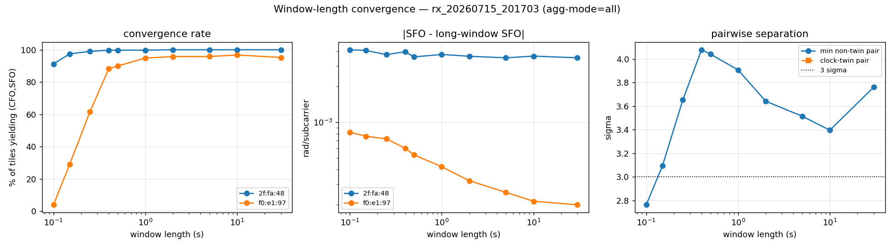
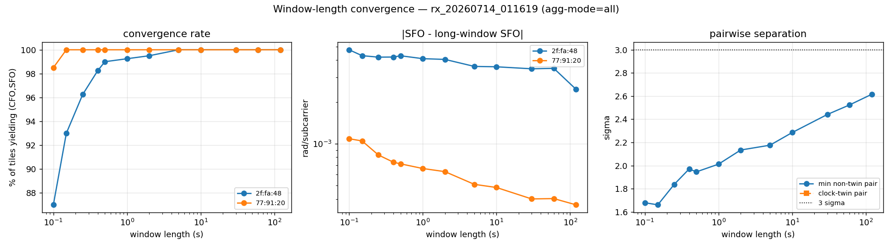

# Short-window RF fingerprinting — how brief can an observation be?

**Experiment run 2026-08-15. Every number below was produced this session by
`pc/exp_window_convergence.py` against CSVs in `data/raw/`. Nothing here is
modelled, extrapolated or predicted. Where something could not be measured,
it says so.**

Script: `pc/exp_window_convergence.py` (new; nothing under `pc/rff/`,
`pc/occ/` or any existing entry point was modified). It imports the real
`FrameEstimator`, `WindowAggregator`, `Discriminator` and `DriftTracker`
from `rff/`, and the real CSV reader from `rff_offline.py`. No DSP is
reimplemented. No new dependency: numpy and matplotlib only, both already in
`pc/requirements.txt`. **pandas and scipy are not used.**

---

## 1. The question

`pc/rff/` was built for sustained observation — our own beacons transmit all
day, and the RANSAC/Kalman estimator has effectively unlimited frames to
settle. The outward-facing case is the opposite: a radio that passes the
building and is audible for seconds. How short can the observation get before
the fingerprint stops being usable?

## 2. Method

**Truncation.** Each source's stream is cut into **non-overlapping** tiles of
length *L* seconds (non-overlapping so trials are independent rather than
sliding-window correlated). Every tile is fingerprinted from a cold start:

```python
est = FrameEstimator()        # no unwrap anchor and no CFO history
agg = WindowAggregator(...)   # carried in from before the tile
```

That is a faithful simulation of *"this is the entire time you could hear
this radio."* One observation is built per tile from every frame the
aggregator accepts (`--agg-mode all`), which is the transient case: you get
one look and you use all of it.

**Time base** is the ESP timestamp, unwrapped across its 32-bit microsecond
rollover. `pc_time_us` is stamped per serial drain batch, not per frame
(`docs/HANDOFF.md`), so it is used only for the census in §6, never for
window boundaries.

**Feature and scoring** are the production ones: the `(CFO, SFO)` vector, the
`Discriminator`'s pooled-covariance Mahalanobis separation, and the same
chronological 60/40 train/holdout split rule as `rff_offline.py`
(`TRAIN_FRACTION` is imported, not copied).

**Reference-beacon correction was not applied.** Every comparison here is
within a single session, and `docs/HANDOFF.md` records that reference
subtraction does not help within-session same-model separation. These are
raw, uncorrected numbers.

**Sessions used** (read-only):

| session | span | sources used |
|---|---|---|
| `rx_20260714_011619.csv` | 2754 s | 3 ESP32 beacons: `a4:f0:0f:77:91:20` (50.4 fps), `f4:2d:c9:70:72:30` (57.6), `28:05:a5:2f:fa:48` (32.0) |
| `rx_20260715_201703.csv` | 14006 s | `28:05:a5:2f:fa:48` (39.0 fps) and ambient `62:45:b4:f0:e1:97` (1170 frames, bursty) |
| `desk_20260712_124142.csv` | 4731 s | `a4:f0:0f:77:91:20` and transient `f2:63:1b:c3:0f:12` |

Reproduce:

```
python exp_window_convergence.py extract ../data/raw/rx_20260714_011619.csv \
    --macs a4:f0:0f:77:91:20,28:05:a5:2f:fa:48,f4:2d:c9:70:72:30
python exp_window_convergence.py run --session rx_20260714_011619 \
    --exclude-macs f4:2d:c9:70:72:30 --lengths 120,60,30,10,5,2,1,0.5,0.4,0.25,0.15,0.1 \
    --dump-trials trials.csv --json results.json
python exp_window_convergence.py quality --session rx_20260714_011619 --burst-window 1.0
python exp_window_convergence.py census "../data/raw/*.csv" --out census.csv
python exp_window_convergence.py transients --census census.csv --frame-threshold 2
```

A long sweep can be split across several `run` invocations (one or a few
`--lengths` each) and recombined with `merge`; the full-session reference
values are cached to `<session>.longwindow.json` so they are computed once.

Reruns are bit-identical (verified: the 5 s row computed in two separate
invocations compared equal), because `FrameEstimator` seeds its RNG.

---

## 3. Headline answer

**The window does not have a length limit. It has a *frame* limit — two.**

The binding constraint is the CFO finite difference in `FrameEstimator.feed`,
which needs two consecutive accepted frames less than 1 s apart. With one
accepted frame the SFO slope still exists but CFO does not, so the 2-D
production feature cannot be formed at all. Everything else degrades
gracefully and slowly.

Convert that into seconds through the source's *received* packet rate:

| regime | shortest window that still works | measured at that length |
|---|---|---|
| **Cross-manufacturer** (ambient device vs. our beacon) | **0.4 s** | 88% convergence, 4.08σ, **96.3% holdout over 301 windows** |
| — degraded but still working | 0.25 s | 62% convergence, 3.65σ, 95.7% over 258 windows |
| — collapses | 0.15 s | 29% convergence (median 1 frame per tile) |
| **Same-model ESP32** (two distinct units) | never reaches 3σ at *any* length | best case 120 s: 2.62σ, 94.4% over 18 windows |
| **Clock twins** | irrelevant — 0.32–0.44σ at every length from 0.5 s to 120 s | |

**So: for the outward-facing use case, sub-second fingerprinting works.**
0.4 s of audibility from a passing radio was enough to identify it correctly
96% of the time in this data. That is a positive answer to the gating
question — with the sizeable caveats in §5, the most important of which is
that it rests on **one** ambient device.

---

## 4. Results

### 4.1 Cross-manufacturer — ambient `62:45:b4:f0:e1:97` vs beacon `28:05:a5:2f:fa:48`

Session `rx_20260715_201703`. This is the regime the security use case lives
in, and the one `docs/HANDOFF.md` cites for 11–15σ. `62:45` is a
locally-administered (randomized) MAC — a real non-ESP32 device — that
delivers frames in dense bursts: **up to 38 frames in a one-second sliding
window** (`exp_window_convergence.py quality --burst-window 1.0`, measured on
the unwrapped ESP clock). It is also an unusually clean source — median
inlier ratio 0.981 at RSSI −37 dBm, 99.7% of its frames accepted.

| window | tiles/source | median frames/tile | convergence | separation | holdout accuracy | N windows |
|---|---|---|---|---|---|---|
| 30 s | 21 | 55 | 95% | 3.76σ | 98.8% | 168 |
| 10 s | 31 | 33 | 97% | 3.40σ | 98.8% | 172 |
| 5 s | 48 | 22 | 96% | 3.51σ | 97.8% | 179 |
| 2 s | 95 | 13 | 96% | 3.64σ | 96.4% | 197 |
| 1 s | 175 | 6 | 95% | 3.91σ | 98.2% | 227 |
| **0.5 s** | 328 | 3 | 90% | 4.04σ | 96.8% | 278 |
| **0.4 s** | 399 | 3 | 88% | 4.08σ | 96.3% | 301 |
| 0.25 s | 400 | 2 | **62%** | 3.65σ | 95.7% | 258 |
| 0.15 s | 400 | 1 | **29%** | 3.09σ | 92.1% | 203 |
| 0.1 s | 400 | 1 | **4%** | 2.76σ | 98.7% | 153 |

Convergence is the fraction of tiles yielding a usable `(CFO, SFO)` pair;
it is the column that fails, and it fails exactly where the median tile
stops containing two frames. Accuracy stays high below that only because the
few tiles that *do* converge are the dense ones — the 98.7% at 0.1 s is
computed over the surviving 4%, and is not a usable operating point.



### 4.2 Same-model ESP32, clock twin excluded — `a4:f0:0f:77:91:20` vs `28:05:a5:2f:fa:48`

Session `rx_20260714_011619`.

| window | tiles/source | median frames/tile | convergence | separation | holdout accuracy | N windows |
|---|---|---|---|---|---|---|
| 120 s | 22 | 3826 | 100% | 2.62σ | 94.4% | 18 |
| 60 s | 45 | 1932 | 100% | 2.52σ | 88.9% | 36 |
| 30 s | 91 | 967 | 100% | 2.44σ | 87.8% | 74 |
| 10 s | 275 | 321 | 100% | 2.29σ | 83.6% | 220 |
| 5 s | 400 | 160 | 100% | 2.18σ | 83.4% | 320 |
| 2 s | 400 | 64 | 100% | 2.13σ | 82.5% | 320 |
| 1 s | 400 | 32 | 99% | 2.01σ | 78.4% | 319 |
| 0.5 s | 400 | 16 | 99% | 1.95σ | 80.6% | 319 |
| 0.4 s | 400 | 13 | 98% | 1.97σ | 78.6% | 318 |
| 0.25 s | 400 | 8 | 96% | 1.84σ | 78.3% | 314 |
| 0.15 s | 400 | 5 | 93% | 1.66σ | 73.1% | 309 |
| 0.1 s | 400 | 3 | 87% | 1.68σ | 76.2% | 298 |

Shrinking the window by 1200× costs 2.62σ → 1.68σ and 94% → 76%. The
same-model regime never clears the 3σ "reliably separable" line at *any*
window length, which is consistent with the ≈77% same-model figure already
recorded in `docs/HANDOFF.md` — reached here from a completely different
direction. **This is a two-class problem, so chance is 50%, not 33%.**



### 4.3 The clock-twin pair, reported separately

Per `CLAUDE.md`, `f4:2d:c9:70:72:30` and `a4:f0:0f:77:91:20` are folded out
of the analysis above. With all three beacons in the population
(`rx_20260714_011619`):

| window | twin-pair separation | 3-class holdout | N |
|---|---|---|---|
| 120 s | 0.44σ | 59.3% | 27 |
| 60 s | 0.42σ | 66.7% | 54 |
| 30 s | 0.40σ | 55.9% | 111 |
| 10 s | 0.36σ | 53.0% | 330 |
| 5 s | 0.34σ | 50.8% | 480 |
| 2 s | 0.33σ | 55.4% | 480 |
| 1 s | 0.32σ | 55.3% | 479 |
| 0.5 s | 0.33σ | 56.2% | 479 |

Two things worth recording:

1. **The twin pair reproduces its documented 0.3σ coin-flip** across every
   window length. `docs/HANDOFF.md` measured 0.3σ by a different route; this
   harness independently lands on 0.32–0.44σ. That is a useful validation
   that the harness is measuring the right thing.
2. **Window length is irrelevant to the twins.** 0.33σ at 0.5 s and 0.44σ at
   120 s — 240× more observation buys nothing. This is exactly the behaviour
   expected of a physical collision between two near-identical crystals
   rather than an observation-time problem, and it is why the twins must be
   held out of a window-length study: over these same eight window lengths,
   including them drags the headline accuracy from **78–94%** (§4.2) down to
   **51–67%**, and would have made window length look far worse than it is.

### 4.4 The real limit is signature wander, not observation length

Re-binning every individual tile by the number of frames the aggregator
actually accepted, per source, against that source's own full-session median.
Pooled from `--dump-trials` over the window lengths that were dumped:
0.1–5 s for `rx_20260714_011619`, 0.1–2 s for `rx_20260715_201703` (the
short lengths, which is where the frame counts of interest occur):

`28:05:a5:2f:fa:48` (`rx_20260714_011619`, long-window SFO +0.01228, IQR 0.00808):

| accepted frames | tiles | convergence (CFO+SFO) | median \|ΔSFO\| | p90 \|ΔSFO\| | vs. its own long-window IQR |
|---|---|---|---|---|---|
| 1 | 80 | **25%** | 0.01079 | 0.03434 | 1.34× |
| 2 | 129 | 100% | 0.00648 | 0.01486 | 0.80× |
| 3–4 | 394 | 100% | 0.00434 | 0.01118 | 0.54× |
| 8–15 | 695 | 100% | 0.00417 | 0.00957 | 0.52× |
| 32–63 | 396 | 100% | 0.00394 | 0.00812 | 0.49× |
| 128+ | 329 | 100% | 0.00352 | 0.00753 | 0.44× |

`62:45:b4:f0:e1:97` (`rx_20260715_201703`, long-window SFO +0.00127, IQR 0.00042):

| accepted frames | tiles | convergence | median \|ΔSFO\| | p90 \|ΔSFO\| |
|---|---|---|---|---|
| 1 | 913 | **0%** | — | — |
| 2 | 445 | 100% | 0.00068 | 0.00150 |
| 3–4 | 519 | 100% | 0.00052 | 0.00136 |
| 5–7 | 166 | 100% | 0.00041 | 0.00105 |
| 16–31 | 26 | 100% | 0.00032 | 0.00067 |

The same shape holds for all four (source, session) combinations measured.
Two readings:

- **The cliff is at 1→2 frames** and nowhere else. It is not gradual.
- **Past two frames, more observation buys very little.** Going from the
  2-frame bin all the way to each source's *lowest-error* bin improves the
  median error by only **1.6–2.2×** (1.84×, 1.60×, 1.56×, 2.17× for the four
  source/session combinations) — and that is against **8× to 120× more
  frames** (median accepted frames in those bins: 17, 79, 162, 246, versus
  2). Compared instead against each source's most-populated bin, the
  improvement is smaller still: 1.1–1.6×.
- **For three of the four, the error at two frames is already below the
  device's own long-window IQR** (0.64×, 0.69×, 0.80×). The exception is
  `62:45`, whose signature is so tight (IQR 0.00042) that two frames sits at
  1.62× its IQR — it is the one source where more frames measurably help,
  and even there it still classifies at 96%+.

Taken together: the fingerprint's accuracy is bounded mostly by how much the
device's clock signature wanders over the session, not by how long you
listen. That is the mechanism behind §4.1 and §4.2 both being nearly flat.

---

## 5. Caveats — read these before quoting anything above

1. **The cross-manufacturer result rests on one ambient device in one
   session.** `62:45:b4:f0:e1:97` is the only non-ESP32 source in the whole
   13 GB dataset with enough frame density to survive truncation. "0.4 s
   works" is one device pair, not a population. This is the single largest
   limitation and the obvious thing to fix with new capture.
2. **All three named regimes are two-class or three-class problems.** Chance
   is 50% (§4.1, §4.2) or 33% (§4.3). These accuracies are *not* comparable
   to the 99.7% / 95.7% figures in `PROJECT_NOTES.md`, which come from a
   different population with a different class count, dominated by the
   reference beacon's very large and easy sample count.
3. **Separation appears to *rise* as the window shrinks in §4.1
   (3.40σ at 10 s → 4.08σ at 0.4 s). Do not read that as "shorter is
   better."** Shorter tiles mean far more of them, which changes both the
   pooled covariance and the train/test split sizes. It is a sample-size
   artifact of the metric, not a physical improvement.
4. **Everything is within-session.** No cross-session or cross-receiver
   generalization was tested, and no thermal drift between sessions is
   exercised. The chronological 60/40 split does test train-early/test-late
   *within* a session.
5. **Reference-beacon correction is off** (§2). Numbers are raw.
6. **`62:45`'s frames arrive in bursts.** A "0.5 s window" for it means 0.5 s
   containing part of a burst; it is not audible continuously across the
   session. Its 1170 frames amount to roughly 6.6 s of actual air time spread
   over 3310 s.
7. **A few timestamps stay non-monotonic after rollover unwrapping** — 2 to 9
   steps per source in the sessions used, 73 for `a4:f0` in
   `desk_20260712_124142`. They were not repaired or dropped.
8. **`--agg-mode all` is not the production default.** Production
   `WindowAggregator(window=64)` emits nothing at all until 64 frames are
   accepted, which at these received rates is ~1.1–2.0 s and makes anything
   shorter structurally impossible. The short-window results above therefore
   describe what the pipeline *could* do if the aggregator window were made
   adaptive — they are not what `rff_live.py` does today. That change was not
   made; `pc/rff/` was left untouched.
9. **Frame counts in §6 are captured frames, not accepted frames**, and the
   census cannot tell whether a source's frames were consecutive. The 2-frame
   threshold is in accepted frames within one window.

---

## 6. Transient sources in the July data

Separate, later question, answered from a per-file per-MAC census
(`exp_window_convergence.py census`). All 62 files in `data/raw/` were
scanned; 50 produced at least one row (the other 12 are 0-byte or
header-only), giving 910 (file, MAC) rows, cross-checked against an
independent awk pass that produced the same 910 rows. Our own four MACs are
excluded throughout.

**Reported as counts and durations only. What any of these sources physically
were is not something this data can establish, and nothing below should be
read as a claim about vehicles, people or anything else.**

"Span" is last-seen minus first-seen on the pc clock within one file. It is an
**upper bound** on contiguous presence, not a measurement of it — a MAC seen
once at the start and once at the end of a session reads as a long span.

**543 distinct non-ours MACs** appear across the dataset.

| span within a file | sources | total frames |
|---|---|---|
| exactly 0 s (a single frame, or one instant) | 414 | 445 |
| 0 < span ≤ 1 s | 37 | 146 |
| 1 s < span ≤ 10 s | 15 | 202 |
| 10 s < span ≤ 60 s | 19 | 1004 |
| 60 s < span ≤ 10 min | 11 | 686 |
| span > 10 min | 47 | 53666 |
| **total** | **543** | **56149** |

- **480 of 543 appear in exactly one session file** and never again.
- **63 appear in more than one file.** Of those, 25 in two files, 9 in three,
  8 in four, and one MAC (`1c:ce:51:f3:0d:fa`) in 34.
- **410 of 543 never exceeded one frame in any single file** — under the
  measured threshold these cannot be fingerprinted at all.
- **133 reached ≥ 2 frames in a single file.** Of the single-appearance
  sources, 81 reached ≥ 2 frames, 37 reached ≥ 5, 18 reached ≥ 10, and 4
  reached ≥ 100.

Single-appearance sources with ≥ 20 frames — the candidates with enough raw
material to attempt a fingerprint (LAA = locally-administered/randomized MAC):

| MAC | frames | span | rate | LAA | file |
|---|---|---|---|---|---|
| `96:b3:f7:e2:af:e7` | 978 | 14600.0 s | 0.1 fps | y | `rx_20260722_XXXXXX.csv` |
| `7e:ed:82:d6:23:e8` | 466 | 6462.4 s | 0.1 fps | y | `rx_20260715_201703.csv` |
| `f2:63:1b:c3:0f:12` | 262 | 57.7 s | 4.5 fps | y | `desk_20260712_124142.csv` |
| `36:90:23:b0:73:40` | 124 | 39.0 s | 3.2 fps | y | `rx_20260715_201703.csv` |
| `06:19:56:8c:4d:bf` | 76 | 134.4 s | 0.6 fps | y | `rx_20260722_XXXXXX.csv` |
| `5a:e4:03:c9:b5:2b` | 72 | 48.3 s | 1.5 fps | y | `rx_20260722_XXXXXX.csv` |
| `ca:5a:2f:bc:af:71` | 48 | 55.3 s | 0.9 fps | y | `desk_20260713_172009.csv` |
| `ee:ac:53:71:d8:9d` | 41 | 65.0 s | 0.6 fps | y | `rx_20260722_XXXXXX.csv` |
| `e6:2d:8e:04:66:09` | 36 | 70.9 s | 0.5 fps | y | `rx_20260722_XXXXXX.csv` |
| `be:ab:a0:22:06:81` | 25 | 5.2 s | 4.8 fps | y | `rx_20260722_XXXXXX.csv` |
| `28:ea:0b:73:71:0f` | 24 | 0.0 s | — | n | `desk_20260713_172009.csv` |

### 6.1 Two of these were actually put through the pipeline

Rather than infer from frame counts, two were extracted and fingerprinted.

**`7e:ed:82:d6:23:e8` — succeeded.** 466 frames in `rx_20260715_201703`,
single appearance. It produced 5 full-session observations and, at 0.5 s
tiles, 26 tiles at 96% convergence. A genuine one-off source *was*
fingerprintable.

**`f2:63:1b:c3:0f:12` — failed, and instructively.** 262 frames at 4.5 fps
over 57.7 s, single appearance. It has 45 frames in a 10 s window — far more
than the two-frame threshold. It nevertheless produced **zero usable
observations at every window length tested, and zero over the full session.**

Cause, measured directly by
`exp_window_convergence.py quality --session desk_20260712_124142`
(whole stream, both sources in the same session file):

| source | frames | RANSAC fit | inlier p10/p50/p90 | resid p50 | passes resid gate | **accepted** | median RSSI |
|---|---|---|---|---|---|---|---|
| `a4:f0:0f:77:91:20` (beacon) | 138475 | 138427 | 0.423 / 0.577 / 0.808 | 0.161 | 100% | **42.4%** | −87 dBm |
| `f2:63:1b:c3:0f:12` (transient) | 262 | 262 | 0.365 / 0.404 / 0.462 | 0.171 | 100% | **0.0%** | −75 dBm |

RANSAC returns a fit for every one of its 262 frames and the residual gate
passes all of them, but its inlier ratio never reaches `WindowAggregator`'s
`min_inlier_ratio = 0.6`, so not one frame is accepted. It is *not* a weak
signal: at −75 dBm it is 12 dB stronger than the beacon that works. Its CSI
rows are `len=128` where the beacon's are `len=256`; whether that is the
cause was not established and is not claimed here.

**This is a second, independent failure mode.** Enough frames is necessary
but not sufficient — a strong, frame-rich transient can be rejected wholesale
by the phase-linearity quality gate. Any estimate of "how many transients we
could have fingerprinted" based on frame counts alone is therefore an upper
bound. Of the 543 sources, only these two were actually run through the
pipeline; the other 541 were not, and no claim is made about them.

---

## 7. What this does and does not settle

**Settled by measurement:**

- Sub-second fingerprinting is not blocked by the estimator. Two accepted
  frames is the hard floor, and 0.4 s of a reasonably chatty ambient device
  clears it comfortably.
- Observation length is a weak lever. Past two frames, accuracy is bounded by
  thermal wander of the device's own signature, not by how long you listen.
- The clock-twin collision is invariant to window length, confirming it as a
  hardware property and not an observation-time artifact.

**Not settled, and needing new data rather than new analysis:**

- Generalization beyond one ambient device (caveat 1). This is the blocker
  for treating "0.4 s" as a real spec.
- Whether a transient's fingerprint is stable across *separate* passes — no
  source in this dataset recurs briefly enough, often enough, with enough
  frames, to test it.
- How often the §6.1 quality-gate rejection hits real ambient traffic. One
  confirmed case out of two attempted is not a rate.
- Whether reference-beacon correction changes any of this. Not tested.
